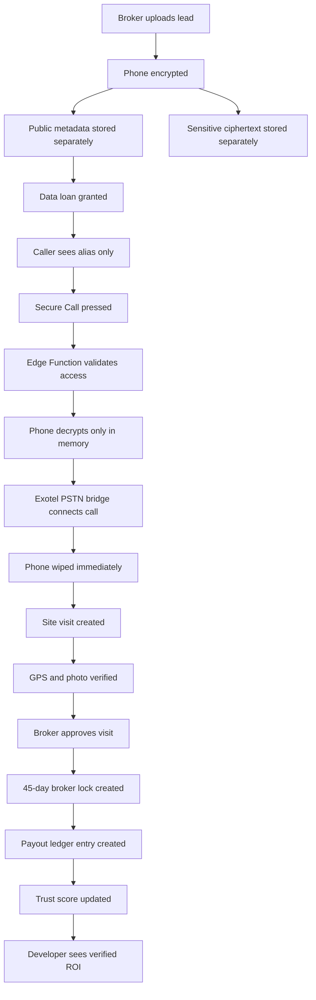

# The Sourcing Manager OS - Start-to-End Roadmap Blueprint

This document defines the intended product roadmap and operating model for The Sourcing Manager OS.

Important status rule: this roadmap is not deployment evidence. Actual readiness must be proven through `REAL_BUILD_VERIFICATION_REPORT.md`, live SQL evidence, Edge Function deployment logs, browser Network inspection, Supabase logs, and full UAT.

## 0. What We Are Building

The Sourcing Manager OS is a trustless real estate sourcing enforcement system for India.

It is built for brokers, callers, sourcing managers, developers, admins, compliance teams, and finance teams.

Mission:

- Stop lead theft.
- Stop fake site visits.
- Stop commission disputes.
- Protect broker-owned data.
- Give developers real ROI visibility.

It is not a normal CRM, lead marketplace, lead-sharing tool, contact database, phone-number viewing system, or WhatsApp automation layer.

It is a data enforcement layer for real estate sourcing.

## 1. Core Constitution

These rules never change:

- Phone numbers are never visible.
- No masked phone numbers.
- No last 4 digits.
- No WhatsApp links.
- No browser `tel:` links.
- No phone in logs.
- No phone in exports.
- No phone in browser network payloads.
- Phone stored only as encrypted ciphertext.
- Decryption only inside Edge Functions.
- Calls only through PSTN bridge such as Exotel.
- RLS enabled on all tables.
- Default deny access.
- Active data loan required for sensitive actions.
- Audit logs append-only.
- Broker data ownership protected.
- System fails closed.
- No shortcut may weaken trust.

If anyone asks for phone reveal, export, WhatsApp shortcut, masked number, last-four display, or admin reveal button:

This violates the system constitution.

## 2. High-Level System Flow

## 3. User Roles

`platform_admin`: manages organizations, users, incidents, diagnostics, and high-level disputes.

`developer_admin`: views project ROI, verified site visits, broker performance, payout liability, and project records.

`broker_owner`: uploads leads, grants/revokes data loans, reviews visits, tracks locks, views payout eligibility, and raises disputes.

`broker_agent`: works under a broker owner and manages assigned broker activity.

`caller`: calls assigned leads through Secure Call only and updates safe call outcomes.

`sourcing_manager`: starts visits, submits GPS, uploads live photo proof, and completes verification steps.

`compliance_admin`: handles DPDP, TRAI/DND, RERA, and GST-ready compliance reports.

`dispute_admin`: handles disputes through the evidence timeline.

`finance_admin`: handles payout ledgers, payout statements, and eligibility review.

`read_only_auditor`: views safe audit and evidence summaries only.

## 4. Tech Stack

Frontend:

- Flutter Web / PWA
- Mobile-first field UI
- Role-based dashboards
- Training mode
- Hinglish helper text

Backend:

- Supabase
- PostgreSQL
- Supabase Edge Functions
- Supabase Storage
- RLS
- pgcrypto

Calling:

- Exotel PSTN bridge
- Twilio fallback later only if needed
- No VoIP
- No direct browser calling

Hosting:

- India/Mumbai region preferred
- Supabase production
- Flutter web hosting

## 5. Data Strategy

Public layer stores safe metadata:

- lead id
- alias
- area
- city
- project
- budget
- status
- assigned user ids
- compliance status

Sensitive layer stores only encrypted phone ciphertext.

The public and sensitive layers must never merge.

## 6. Sprint Roadmap

| Sprint | Version | Layer | Goal | Acceptance Gate |
| --- | --- | --- | --- | --- |
| 0 | planning | Foundation | Mission, constitution, threat model, architecture | Architecture agreed and constitution frozen |
| 1 | v0.1.0 | Broker data protection | Encrypt lead phone data and enable Secure Call | No phone appears anywhere; no active loan returns access denied |
| 2 | v0.2.0-stable | Site visit truth | GPS/photo verification and broker locks | Outside geofence rejected; verified approval creates 45-day lock |
| 3 | v0.3.0-trust | Trust and disputes | Pilot operations, disputes, trust scoring | Only active pilot users act; verified events affect trust |
| 4 | v0.4.0-ops | Abuse monitoring | Risk events, notifications, trust decay | Repeated failures and disabled/paused access attempts are flagged |
| 5 | v0.5.0-scale | Payout and routing | Payout eligibility and trust-gated routing | Verified locks create PII-free payout entries |
| 6 | v0.6.0-compliance | Compliance governance | DPDP, DND, RERA, GST-ready reports, incident response | Consent/DND evidence exists; incident lockdown blocks access |
| 7 | v0.7.0-enterprise | Enterprise onboarding | Self-serve org/user onboarding with RBAC | No active user without org, role, permissions, and pilot approval |
| 8 | v0.8.0-field | Field UX | Training mode, guidance, poor-network handling | Field users understand blocked states; training cannot mutate production |
| 9 | v0.9.0-reliability | Reliability | Health, diagnostics, rate limits, backup/rollback | Failures tracked without PII; rollback and restore drills evidenced |
| 10 | v1.0.0-stable | Launch hardening | Security review, UAT, policies, launch runbook | UAT passes with evidence; legal and operational gates complete |

Do not publicly position Sprint 5 as a marketplace. Correct wording:

- Trust-gated sourcing enforcement system
- Performance visibility
- Dynamic lead routing

## 7. Edge Function Blueprint

Sprint 1:

- `broker-upload-lead`
- `initiate-call`
- `exotel-callback`

Sprint 2:

- `create-site-visit`
- `start-site-visit`
- `verify-site-gps`
- `upload-site-photo`
- `broker-review-site-visit`

Sprint 3:

- `open-dispute`
- `add-dispute-event`
- `resolve-dispute`
- `calculate-trust-score`
- `admin-pilot-action`

Sprint 4:

- `flag-abuse-event`
- `resolve-abuse-event`
- `generate-risk-summary`
- `create-risk-notification`
- `acknowledge-risk-notification`
- `run-trust-decay`

Sprint 5:

- `run-payout-eligibility`
- `route-incoming-leads`
- `generate-broker-ledger`

Sprint 6:

- `generate-payout-statement`
- `incident-response`
- `generate-compliance-report`
- `record-consent`

Sprint 7:

- `create-organization`
- `invite-user`
- `accept-invite`
- `assign-role`
- `activate-user`
- `deactivate-user`
- `suspend-user`
- `pause-organization`
- `resume-organization`
- `update-permission-template`

Sprint 8:

- `training-mode-session`
- `record-ux-event`

Sprint 9:

- `check-rate-limit`
- `generate-diagnostics`
- `record-backup-run`
- `record-restore-drill`
- `record-deployment-event`
- `record-rollback-event`

## 8. Frontend Screen Blueprint

Core screens:

- Login
- Role dashboard
- Lead queue
- Broker upload
- Secure call status
- Site visit list
- GPS verification
- Photo upload
- Broker review
- Evidence timeline

Trust and risk screens:

- Dispute list
- Dispute detail
- Trust score view
- Trust score history
- Abuse alerts
- Risk dashboard

Finance screens:

- Payout ledger
- Broker payout statement
- Finance admin dashboard
- Developer ROI dashboard

Enterprise screens:

- Organization dashboard
- Invite user
- Role assignment
- Permission template editor
- Suspended users
- Onboarding audit timeline

Field UX screens:

- Training mode
- User guides
- GPS permission help
- Camera permission help
- Offline or poor-network state
- Hinglish guidance

Reliability screens:

- System health
- Edge Function failures
- Provider failures
- Rate limit events
- Deployment history
- Backup/restore status
- Diagnostics snapshot

## 9. Security Model

Main controls:

- PostgreSQL RLS
- Default deny
- Edge Function validation
- Service role only in backend
- Data loans
- RBAC
- Pilot active checks
- Org active checks
- Suspension checks
- Rate limits
- Audit logs
- Private storage
- Encryption

Sensitive data rules:

- No phone in UI
- No phone in logs
- No phone in exports
- No phone in audit events
- No phone in diagnostics
- No phone in storage paths
- No masked phone
- No last-four display

Protected actions must go through Edge Functions:

- Lead upload
- Call initiation
- Data loan grant/revoke
- Site visit creation
- GPS verification
- Photo upload
- Broker review
- Dispute resolution
- Payout eligibility
- Role assignment
- Organization pause/resume
- Incident lockdown

## 10. Compliance Model

DPDP:

- Consent ledger
- Purpose tracking
- Access audit
- Revocation support
- Data minimization
- No unnecessary PII exposure

TRAI/DND:

- DND checked before call
- Consent required
- Blocked calls logged safely
- Compliance report available

RERA:

- Project registry
- RERA number
- RERA verification flag
- Project audit timestamps

GST/finance:

- Payout ledger
- Broker statements
- GST-ready payout records
- PII-free finance reports

AGPL:

- AGPLv3 license
- Public notice
- Source availability requirement
- No closed forks without compliance

## 11. Testing Blueprint

Security tests:

- No phone in UI
- No phone in logs
- No phone in exports
- No raw provider payload
- No public storage evidence
- RLS enabled on all tables
- Sensitive lead table not selectable by frontend users
- Audit events append-only

Workflow tests:

- Broker uploads lead
- Caller blocked without loan
- Caller can call with active loan
- Expired loan blocks call
- Revoked loan blocks call
- DND blocks call
- Missing consent blocks call
- GPS outside geofence rejected
- GPS inside geofence accepted
- Photo uploaded safely
- Broker approval creates lock
- Payout entry created
- Trust score updates
- Dispute opened and resolved
- Abuse event generated

Admin tests:

- Create organization
- Invite user
- Assign role
- Activate user
- Suspend user
- Pause organization
- Generate report
- Run incident response
- View diagnostics

Reliability tests:

- Rate limit triggers
- Provider failure logged safely
- Diagnostics show counts only
- Backup run recorded
- Rollback event recorded
- Flutter build passes
- Security scanner passes

## 12. Launch Checklist

Before real commercial launch:

- [ ] Legal review completed
- [ ] Privacy Policy approved
- [ ] Terms of Use approved
- [ ] DPDP notes reviewed
- [ ] TRAI/DND process reviewed
- [ ] RERA/GST notes reviewed
- [ ] AGPL notice published
- [ ] Production Supabase configured
- [ ] Exotel production credentials configured
- [ ] `PHONE_ENCRYPTION_KEY` stored safely
- [ ] Storage buckets private
- [ ] Edge Functions deployed
- [ ] Flutter app deployed
- [ ] Test data cleaned
- [ ] One complete UAT flow passed
- [ ] Support owner assigned
- [ ] Incident owner assigned
- [ ] Compliance owner assigned
- [ ] Payout owner assigned
- [ ] Dispute owner assigned
- [ ] Launch runbook followed

## 13. Hard Truth Gate

The project is only truly built if these are real and evidenced:

- Code exists
- Migrations exist
- Edge Functions exist
- Flutter app builds
- Supabase deployed
- Exotel connected
- Security scanner passes
- Real lead upload works
- Real secure call works
- Real GPS/photo verification works
- Real broker lock works
- No phone leaks anywhere

If not verified, the project is documented, not live.

## 14. Post-v1 Direction

After v1.0, only build features that strengthen trust, compliance, reliability, enterprise adoption, developer ROI, or broker protection.

Possible future sprints:

- Sprint 11: Mobile app packaging, push notifications, device attestation
- Sprint 12: AI dispute summarizer, compliance assistant, abuse pattern detection, onboarding helper
- Sprint 13: RERA integration, developer CRM integration, ERP payout integration, webhook APIs
- Sprint 14: Multi-city operations, regional compliance settings, org-level billing, SLA dashboards

## 15. One-Line Summary

The Sourcing Manager OS is a trust-gated data enforcement layer for Indian real estate sourcing that protects broker-owned leads, verifies site visits with evidence, prevents commission disputes, and gives developers ROI visibility without exposing sensitive customer data.

