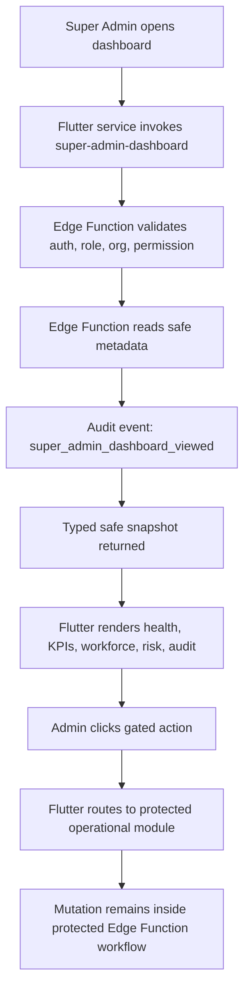

# Super Admin Dashboard Architecture

## Verdict

Final verdict: B. PARTIAL - DASHBOARD BUILT BUT RELEASE GATE / PERMISSION UAT BLOCKED.

The Super Admin Dashboard is implemented as a read, route, govern, and audit command center. It is not a database editor and it does not expose customer PII or sensitive broker records in the Flutter UI.

## What Was Built

- Flutter control-room screen: `flutter_app/lib/screens/super_admin_dashboard.dart`
- Typed Flutter model alias and snapshot model:
  - `flutter_app/lib/models/super_admin_snapshot.dart`
  - `flutter_app/lib/models/super_admin_dashboard_snapshot.dart`
- Flutter service wrapper: `flutter_app/lib/services/super_admin_dashboard_service.dart`
- Super Admin widgets:
  - `platform_health_card.dart`
  - `attention_queue_card.dart`
  - `organization_card.dart`
  - `workforce_performance_card.dart`
  - `broker_performance_table.dart`
  - `caller_performance_table.dart`
  - `sm_performance_table.dart`
  - `project_health_card.dart`
  - `audit_timeline_card.dart`
  - `risk_alert_card.dart`
  - `quick_action_panel.dart`
  - `workflow_bottleneck_card.dart`
  - `trust_operations_card.dart`
- Supabase Edge Function: `supabase/functions/super-admin-dashboard/index.ts`
- Static contract check: `scripts/super-admin-dashboard-static-check.mjs`
- Focused Flutter regression tests: `flutter_app/test/super_admin_dashboard_strategy_test.dart`

## Frontend To Backend Connection

The Flutter screen calls only `SuperAdminDashboardService.loadSnapshot()`. The service invokes the `super-admin-dashboard` Edge Function through Supabase Functions and parses a typed `SuperAdminDashboardSnapshot`.

The screen does not call `.from()`, `.rpc()`, or direct table APIs. All operational data comes from the backend snapshot.

## Safe Data Boundary

The dashboard snapshot uses safe metadata only:

- organization status, project counts, active user counts, risk counts
- platform health counters, failed function counts, provider failure counts
- aggregate workforce metrics
- workflow bottleneck counters
- safe references such as `risk:abcd1234`, `flow:stuck_lead`, and `trust:broker_lock`
- audit event type, actor role, organization reference, and timestamps

The dashboard must not return:

- phone numbers or masked phone fragments
- WhatsApp or tel links
- raw customer records
- raw provider payloads
- private broker/customer data
- service role key or provider secrets
- raw notes

## Gated Actions

The dashboard only displays quick actions present in `allowed_actions`. UI gating is convenience only; backend functions must enforce permission again.

Routed actions include:

- Create Organization -> `OrganizationOnboardingWizard`
- Invite User -> `InviteUserScreen`
- Assign Role -> `RoleManagementScreen`
- Open Risk Dashboard -> `AbuseMonitoringDashboard`
- Open Diagnostics -> `AdminDiagnosticsScreen`
- Open Assignment Queue -> `CallerLeadQueueScreen`
- Open Broker Locks -> `PayoutLedgerScreen`
- Open System Health -> `SystemHealthDashboard`
- Open Release Gate Report -> diagnostics route
- Open Visit Reviews -> `BrokerReviewListScreen`

## Permissions

The dashboard understands these action and permission tokens:

- `view_super_admin_dashboard`
- `view_platform_health`
- `view_risk_dashboard`
- `view_system_health`
- `view_diagnostics`
- `manage_organizations`
- `invite_users`
- `assign_roles`
- `suspend_users`
- `view_audit_events`
- `manage_incidents`
- `view_workforce_reports`
- `view_broker_locks`
- `manage_data_loans`
- `view_developer_projects`
- legacy compatibility tokens such as `can_view_risk_dashboard`, `can_manage_org_users`, `can_pause_org`, `can_suspend_user`, `can_view_payouts`, `can_grant_data_loans`, and `can_review_site_visits`

## Routed Workflows

The dashboard detects or displays routes for:

- leads without caller assignment
- leads without broker attribution
- expired data loans needing review
- overdue followups
- scheduled visits not started
- GPS or proof gaps
- provider callback failures
- broker lock disputes
- payout eligibility pending
- risk notifications and abuse events

Each row carries a severity, safe reference, backend action token, and route.

## Remaining Blockers

- Release gate failed because the local Supabase auth endpoint at `127.0.0.1:54321` was not running.
- Release gate migration dry run reported older local migrations that would need `--include-all` review before remote application.
- Live Supabase UAT was not completed for platform admin accepted, non-admin roles rejected, and audit event persistence on a real project.

