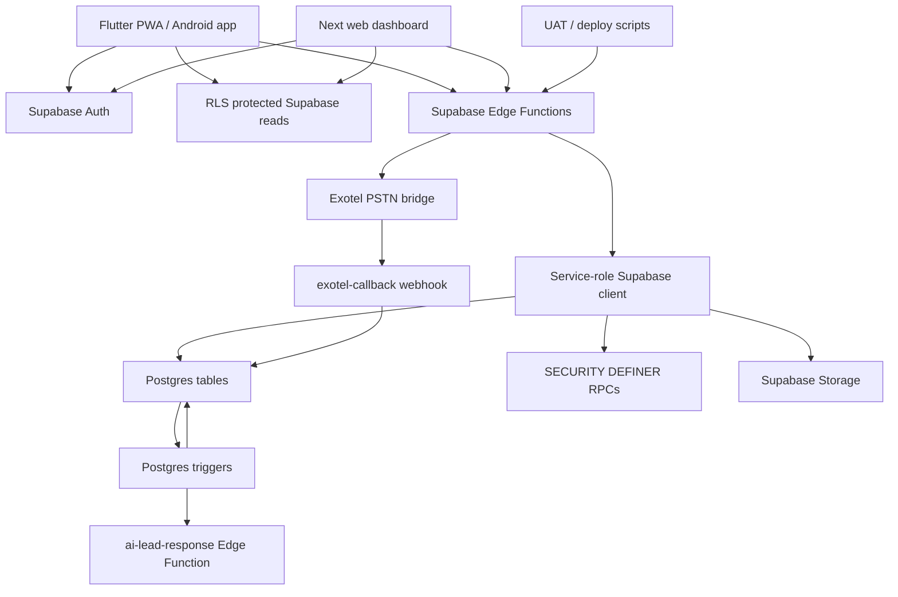

# Backend Logic Connector Map

Date: 2026-05-16
Scope: current repository source under `flutter_app`, `web-dashboard`, `supabase/functions`, `supabase/migrations`, and `supabase/config.toml`.

This map treats a backend connector as any stable boundary where the app talks to backend logic: Supabase Auth, Supabase Edge Functions, Postgres RPCs/triggers, Supabase Storage, and external provider webhooks.

## System Map



## Hard Rules Preserved By The Backend

- Public contact PII is not returned to clients. Phone values are accepted once, encrypted or hashed server-side, and then cleared from function-local variables where implemented.
- Protected writes go through Edge Functions using `currentUser`, `requirePermission`, active pilot-user checks, and organization status checks.
- Sensitive reads and provider calls happen only through service-role backend code.
- `audit_events` is the central safe event log. Existing migrations make it append-only.
- Most Edge Functions require JWT at the Supabase gateway. Only `exotel-callback` and `ai-voice-callback` are configured with `verify_jwt = false`; both must remain explicitly hardened or disabled.
- No WhatsApp outbound send connector is present in the current source. The implemented live provider connector is Exotel PSTN. AI voice placeholders exist but return disabled responses.

## Client Connector Map

| Client surface | Backend connector | Purpose |
| --- | --- | --- |
| `flutter_app/lib/main.dart` + `flutter_app/lib/app_config.dart` | Supabase Auth/client init | Flutter initializes the production Supabase project and session. |
| Flutter role/signup screens | `complete-onboarding` | Creates role assignments, pilot-user rows, and role-specific profiles. |
| Flutter broker lead screens | `broker-upload-lead`, `lead-from-broker`, `broker-vault-workflow` | Lead intake, broker vault actions, status updates, assignments, and follow-ups. |
| Flutter caller screens | `manage-caller-workflow`, `initiate-call` | Caller assignment, call outcome updates, secure Exotel call requests. |
| Flutter broker CRM screens | `manage-external-broker`, `initiate-broker-call` | External broker profile, activation, follow-up, activity, and secure broker call workflows. |
| Flutter site visit screens | `propose-site-visit`, `review-site-visit-proposal`, `start-site-visit`, `verify-site-gps`, `upload-site-photo`, `verify-site-visit-proof`, `broker-review-site-visit` | Proposal, scheduling, field verification, proof upload, broker review, and lock creation. |
| Flutter admin/risk screens | Admin, risk, abuse, diagnostics, payout, trust functions | Organization lifecycle, permissions, risk notifications, trust scoring, payout gates, and incident actions. |
| `web-dashboard/src/lib/supabase.ts` | Supabase JS client | Next dashboard uses env-provided Supabase URL and anon key. |
| `scripts/*.mjs` UAT tools | `/functions/v1/*` and Supabase RPCs | Production smoke tests, UAT flows, schema inspection, release gates. |

## Edge Function Connector Inventory

All functions are registered in `supabase/config.toml`, and every directory under `supabase/functions` has a matching config entry.

| Function | Auth | Domain | Main backend responsibility |
| --- | --- | --- | --- |
| `accept-invite` | JWT | Onboarding | Accepts org invite, creates pending pilot/user/role rows, writes invite audit. |
| `acknowledge-risk-notification` | JWT | Risk | Marks risk notifications acknowledged after org and permission checks. |
| `activate-user` | JWT | Admin/RBAC | Runs activation checks, activates `pilot_users`, updates `user_profiles`, audits activation. |
| `admin-pilot-action` | JWT | Admin/RBAC | Legacy admin wrapper for create org, update org status, and set user role. |
| `ai-lead-response` | JWT | AI placeholder | Auth-required stub currently returning `ai_lead_response_disabled`. DB trigger can target it when enabled. |
| `ai-voice-callback` | Public webhook | AI placeholder | Public callback stub currently returning `ai_voice_callback_disabled`. |
| `ai-voice-churn` | JWT | AI placeholder | Auth-required churn campaign stub currently returning `ai_voice_churn_disabled`. |
| `assign-role` | JWT | Admin/RBAC | Assigns roles and permission templates inside an organization. |
| `broker-review-site-visit` | JWT | Site visit | Uses `broker_review_site_visit_v2` RPC for broker approval/rejection of visits. |
| `broker-self-secure-call` | JWT | Calling | Lets a linked broker call a lead through Exotel after permission, data-loan, consent, and DND checks. |
| `broker-upload-lead` | JWT | Lead intake | Broker lead upload, phone encryption/hash RPC, duplicate detection, `leads_public` plus `leads_sensitive` insert. |
| `broker-vault-workflow` | JWT | Broker vault | Multi-action broker lead workflow: submit lead, assign SM/caller, quality, follow-up, booking, brokerage, issues. |
| `calculate-trust-score` | JWT | Trust | Computes and upserts trust score from recent audit events. |
| `check-rate-limit` | JWT | Security | Records rate-limit events, blocks excessive action attempts, writes abuse/audit metadata. |
| `complete-onboarding` | JWT | Onboarding | Deterministic role onboarding for broker owner/agent, sourcing manager, and caller profiles. |
| `confirm-site-visit-arrival` | JWT | Site visit | Moves a started visit to `client_reached_site` and records confirmation/audit. |
| `create-organization` | JWT | Admin/RBAC | Creates paused org plus profile/onboarding request after admin permission. |
| `create-risk-notification` | JWT | Risk | Creates internal risk notifications for org users. |
| `create-site-visit` | JWT | Site visit | Creates a scheduled visit after active loan and permission checks. |
| `data-loan-workflow` | JWT | Data access | Grants, revokes, and extends time-boxed `data_loans` for call or site visit purposes. |
| `deactivate-user` | JWT | Admin/RBAC | Disables a pilot user and audits deactivation. |
| `dispute-engine` | JWT | Disputes | Opens disputes, adds dispute events, resolves disputes with permission gates. |
| `exotel-callback` | Public webhook | Calling | Validates HMAC token, rejects replay/invalid transitions, updates `call_attempts`, audits callback result. |
| `flag-abuse-event` | JWT | Abuse | Records abuse events with safe evidence, rejects restricted PII terms, recommends freezes for severe cases. |
| `generate-diagnostics` | JWT | Ops | Counts key tables for a diagnostics snapshot and audits it. |
| `generate-payout-statement` | JWT | Finance | Aggregates eligible payout rows and creates payout statements. |
| `generate-risk-summary` | JWT | Risk | Summarizes daily org risk from members, abuse, disputes, visits, and locks. |
| `incident-response` | JWT | Ops/security | Emergency actions such as org pause and loan revocation with abuse audit. |
| `initiate-broker-call` | JWT | Calling | Secure call to broker contact through Exotel after broker/org checks and decryption. |
| `initiate-call` | JWT | Calling | Secure caller-to-lead Exotel bridge after data loan, consent, DND, and PII decryption checks. |
| `invite-user` | JWT | Onboarding | Creates hashed invite code and onboarding request. |
| `lead-from-broker` | JWT | Lead intake | Creates external broker-sourced leads, updates lead status, and schedules visits from leads. |
| `manage-caller-workflow` | JWT | Caller workflow | Assigns leads to callers and updates call outcomes through RPCs. |
| `manage-external-broker` | JWT | Broker CRM | Creates external brokers, updates activation, creates/completes follow-ups, logs activity. |
| `pause-organization` | JWT | Admin/RBAC | Pauses an organization and audits it. |
| `propose-site-visit` | JWT | Site visit | Broker proposes a site visit tied to lead, broker, project, and assigned manager. |
| `resolve-abuse-event` | JWT | Abuse | Closes abuse events after resolve permission check. |
| `resume-organization` | JWT | Admin/RBAC | Runs org activation checks and resumes active org status. |
| `review-site-visit-proposal` | JWT | Site visit | Manager accepts, reschedules, or rejects a proposal and creates/updates scheduled visit records. |
| `route-incoming-leads` | JWT | Routing | Assigns a lead to an eligible broker by routing config and trust tier. |
| `run-payout-eligibility` | JWT | Finance | Marks pending payouts eligible or rejected based on active lock and trust score. |
| `run-trust-decay` | JWT | Trust | Decays inactive user trust scores and writes snapshots. |
| `start-site-visit` | JWT | Site visit | Moves scheduled visit to started after assignment and permission checks. |
| `suspend-user` | JWT | Admin/RBAC | Inserts user suspension and disables pilot user. |
| `system-health-check` | JWT | Ops | Returns recent system health events and Edge Function failures. |
| `trust-create-followup` | JWT | Trust tools | Metadata-only follow-up creation with lead access checks and safe audit. |
| `trust-get-broker-lock-status` | JWT | Trust tools | Returns lock status by lead or broker with linked-broker/admin access checks. |
| `trust-get-followup-risk` | JWT | Trust tools | Computes follow-up delay risk and next action from safe lead metadata. |
| `trust-get-lead-summary` | JWT | Trust tools | Returns PII-safe lead summary fields only. |
| `trust-get-site-visit-proof` | JWT | Trust tools | Returns PII-safe proof metadata for authorized users. |
| `trust-recommend-next-action` | JWT | Trust tools | Deterministic next action recommendation from lead, visit, lock, and follow-up state. |
| `update-permission-template` | JWT | Admin/RBAC | Creates or replaces permission template permissions. |
| `upload-site-photo` | JWT | Site visit/storage | Uploads site evidence photo to Supabase Storage and records proof hash through RPC. |
| `verify-site-gps` | JWT | Site visit | Verifies GPS via distance RPC and updates visit state. |
| `verify-site-visit-proof` | JWT | Site visit | Unified proof state machine for no-show, GPS, QR/code, photo, visit done, and broker lock creation. |

## Critical Deterministic Flows

### 1. Login And Onboarding

`Supabase Auth -> complete-onboarding -> role_assignments -> pilot_users -> role-specific profile`

- Broker roles create or update `brokers_public` and assign a sourcing manager.
- Sourcing managers create/update `sourcing_managers_public`.
- Callers require `CALLER_INVITE_CODE` or `UAT_CALLER_INVITE_CODE`.
- Admin/developer admin onboarding is not self-serve; it returns an approval-required state.

### 2. Broker Lead Intake

`Flutter broker form -> broker-upload-lead -> ingest_lead_contact_secure -> check_duplicate_lead -> leads_public + leads_sensitive`

- Public metadata goes to `leads_public`.
- Phone ciphertext and phone hash go to `leads_sensitive`.
- Duplicate detection writes `abuse_events` and returns a blocked response.
- Response returns only `lead_id` and alias.

### 3. External Broker CRM Intake

`Add broker / broker detail -> manage-external-broker or lead-from-broker -> brokers_public/brokers_sensitive/leads_public/leads_sensitive`

- `manage-external-broker` manages broker profiles, activation stages, follow-ups, and activity logs.
- `lead-from-broker` creates source-linked leads and schedules visits from those leads.
- Notes are sanitized to remove contact-like data.

### 4. Caller Assignment And Outcome

`Manager action -> manage-caller-workflow -> assign_lead_to_caller_v2 or update_lead_call_outcome`

- Assignment updates `leads_public.assigned_caller_id`.
- Existing trigger/RPC logic creates or preserves data-loan behavior.
- Caller outcomes update safe status, callback/follow-up time, and queue fields.

### 5. Secure PSTN Call

`Caller -> initiate-call -> data_loans/consent/DND checks -> decrypt in memory -> Exotel -> exotel-callback`

- `initiate-call` refuses missing, expired, or revoked loans.
- It refuses missing consent and DND-blocked leads.
- It decrypts `leads_sensitive.phone_ciphertext` only inside the Edge Function.
- It creates `call_attempts`, sends the Exotel bridge request, then queues status.
- `exotel-callback` validates HMAC token, rejects replay, enforces allowed state transitions, and updates only call metadata.

### 6. Site Visit Proposal And Proof

`propose-site-visit -> review-site-visit-proposal -> start-site-visit -> verify-site-visit-proof/upload-site-photo -> broker_locks`

- Brokers propose site visits against authorized lead/broker/project records.
- Managers accept, reschedule, or reject.
- Proof progression is deterministic: scheduled/started -> GPS -> QR/code or photo -> visit done.
- `visit_done` creates or extends an active 45-day `broker_locks` row and updates lead brokerage state.

### 7. Follow-Up And Trust Layer

`broker-vault-workflow/trust-create-followup -> broker_followups + leads_public.next_followup_at + audit_events`

- Follow-ups are metadata-only and scrub long digit sequences.
- Risk readers use safe lead metadata to return `risk_level`, `followup_delay`, and `next_action`.
- Recommendations are deterministic and based on lead status, conversion stage, last outcome, visit state, and lock state.

### 8. Payout And Finance

`broker_locks trigger -> payout_ledger -> run-payout-eligibility -> generate-payout-statement`

- Lock creation can seed payout ledger entries through database trigger logic.
- Eligibility requires active lock and sufficient trust score.
- Statement generation aggregates eligible payout rows into `payout_statements`.

### 9. Abuse, Risk, And Incident Response

`check-rate-limit / flag-abuse-event / incident-response -> abuse_events/risk_notifications/audit_events`

- Abuse evidence is restricted to safe terms.
- High-risk conditions can recommend user or organization freeze.
- Incident response can pause orgs and revoke loans.
- Risk notifications and summaries are internal reason-code based messages.

## Database Connector Map

| Backend object group | Tables/RPCs/triggers | Responsibility |
| --- | --- | --- |
| Lead vault | `leads_public`, `leads_sensitive`, `ingest_lead_contact_secure`, `check_duplicate_lead`, `encrypt_lead_contact`, `decrypt_lead_contact_for_edge` | Split public metadata from encrypted contact data; dedupe by phone hash. |
| Data loans | `data_loans`, `has_active_data_loan`, auto data-loan trigger | Time-boxed access grants for call/site visit operations. |
| Calls | `call_attempts`, `exotel-callback` update path | Provider-neutral call metadata, status transitions, replay-safe callbacks. |
| Audit | `audit_events`, append-only trigger, `record_onboarding_audit`, `record_pilot_abuse` | Immutable operational and abuse trace. |
| Site visits | `site_visits`, `site_visit_proposals`, `site_visit_confirmations`, `verify_site_gps_v2`, `upload_site_photo_v2`, `broker_review_site_visit_v2` | Visit state, proof metadata, broker review, and verified visit evidence. |
| Broker locks | `broker_locks`, lock triggers, payout trigger | 45-day source-broker protection after verified visit. |
| Broker CRM | `brokers_public`, `brokers_sensitive`, `broker_activations`, `broker_activity_logs`, `broker_followups`, `broker_issues` | Broker profiles, sensitive contact vault, activation pipeline, activity, follow-up queue, issues. |
| RBAC/org lifecycle | `organizations`, `pilot_users`, `role_assignments`, `permission_templates`, `permission_template_permissions`, `has_strict_enterprise_permission` | Enterprise roles, active user/org gates, permission checks. |
| Risk/ops | `abuse_events`, `risk_notifications`, `trust_scores`, `trust_score_snapshots`, `pilot_activity_daily`, `system_health_events`, `edge_function_failures` | Abuse tracking, risk summaries, trust scoring, operational diagnostics. |
| Finance/disputes | `payout_ledger`, `payout_statements`, `disputes`, `dispute_events` | Broker payout eligibility and dispute lifecycle. |
| Inventory/AI extensions | `projects`, `inventory_units`, `unit_bookings`, `churn_campaigns`, AI webhook trigger | Project inventory and disabled AI/churn scaffolding. |

## External Provider Connectors

| Provider | Source files | Status |
| --- | --- | --- |
| Supabase Auth/Postgres/Storage | `flutter_app`, `web-dashboard`, `supabase/functions`, `supabase/migrations` | Active core backend. |
| Exotel PSTN | `initiate-call`, `broker-self-secure-call`, `initiate-broker-call`, `exotel-callback` | Active connector, requires `EXOTEL_*` secrets. |
| Supabase Storage | `upload-site-photo`, `verify-site-visit-proof` | Active for site evidence; paths are proof-safe, not contact-derived. |
| AI lead/voice | `ai-lead-response`, `ai-voice-callback`, `ai-voice-churn`, AI trigger migration | Scaffolded but disabled by Edge Function responses. |
| Vapi/Bland AI | Migration extends `call_attempts.provider` to include `vapi_ai` and `bland_ai` | Schema support only; no active outbound provider implementation found. |
| WhatsApp | No active source match for outbound WhatsApp send API | Not implemented in current repo source. |

## Production Safety Notes

- Keep new sales or follow-up automations behind Edge Functions, not direct client writes.
- Do not add generic AI decisioning into state transitions. Use explicit status enums and allowed transitions like `exotel-callback` and `verify-site-visit-proof`.
- When adding WhatsApp or any outbound messaging provider, map it like Exotel: deterministic send request table, signed provider callback, replay protection, sanitized audit, and Supabase persistence.
- Any follow-up or inbound-reply cancellation logic should update `broker_followups`, lead status fields, and `audit_events` together.
- Environment-related provider bugs should be checked against Production vs Preview assumptions before changing logic.

## Verification Gates

For runtime code changes, use the repo-specific gates from `AGENTS.md` and project guidance:

```powershell
npm run build
npx tsc --noEmit
```

If root TypeScript is not applicable for Deno Edge Function code, document the result and use Supabase/Flutter verification from `REAL_BUILD_VERIFICATION_REPORT.md`.
