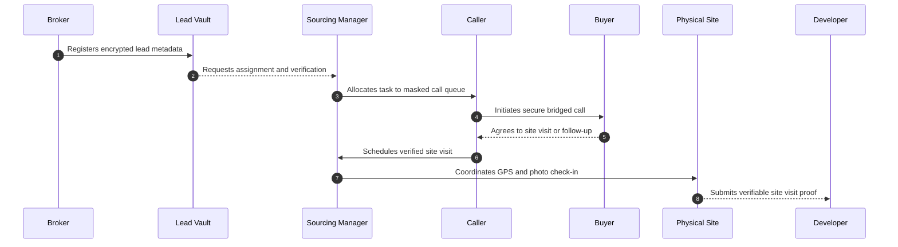
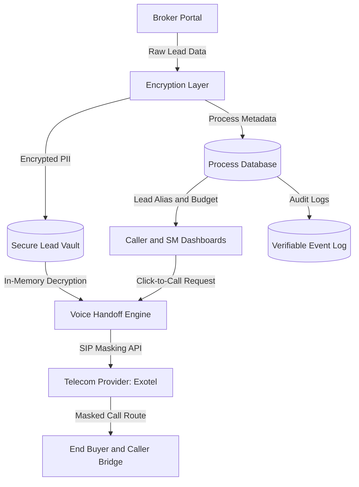

# FutureTrust: The Digital India Real Estate OS

## Master Strategy, Architecture, and Governance Blueprint

Status: Strategy and governance blueprint. Operational completion claims in this document must be verified against live deployment evidence, provider credentials, Supabase deployment state, and UAT reports before launch decisions.

---

## 1. Executive Vision

FutureTrust is India's first governed real estate operational trust infrastructure. Rather than serving as another high-churn CRM or an aggressive lead marketplace, it establishes a decentralized, cryptographically isolated, and audit-verifiable transactional coordination layer.

In the Indian real estate landscape, transactions worth billions of dollars rely on fragmented brokers, under-compensated sourcing managers, and high-turnover telecallers. This operational friction results in systemic distrust: developers default on brokerage attribution, brokers withhold qualified buyer leads out of theft anxiety, and buyers are bombarded by untracked, overlapping spam calls.

FutureTrust resolves this systemic gridlock. By separating identifying data, or PII, from operational metadata, enforcing dynamic cryptographic data loans, and validating physical execution via GPS-stamped multi-lateral check-ins, the platform creates a resilient, high-integrity environment. Sourcing real estate is transformed from a game of informational asymmetry into a standardized, institutional-grade, verifiable operational workflow.

---

## 2. Core Philosophy

The core philosophy of FutureTrust is structured around four immutable laws:

1. **Verifiable Attribution Over Trust**: Never expect participants to trust each other. Instead, make every operational handoff, including lead generation, phone screening, site visits, and booking lock-ins, provable, unalterable, and auditable.
2. **PII Isolation by Default**: A telephone number or buyer email is an enterprise asset. Callers, sourcing managers, and developers should never view raw customer contact info. All voice communication must occur through secure, bridge-based call masking, and metadata must remain encrypted within the Lead Vault.
3. **Workplace Dignity and Permanent Reputation**: Brokers and field-force operators deserve permanent, portable professional records. Real coordination effort, such as scheduling quality site visits or securing genuine client demand, must translate into verifiable reputation metrics that carry across developers and agencies.
4. **Anti-Spam and Consent-Driven Sourcing**: Buyers must not be treated as target lists for endless cold calls. Lead lifecycles are governed by consent-based data loans, meaning access to customer communication windows is metered, revocable, and strictly audited.

---

## 3. Industry Problem Analysis

The Indian real estate market is plagued by structural operational pathologies:

- **The Sourcing Conflict, or Lead Theft**: Independent brokers fear registering high-intent leads with developers because sales teams frequently bypass them to avoid paying 2%-5% commissions.
- **Double-Booking Scams**: Untrusted channels register the same customer under multiple different broker codes, sparking massive commission disputes at the time of purchase booking.
- **Fake Site Visits, or Ghost Verification**: Sourcing managers or sales executives fabricate site-visit reports to meet KPIs, resulting in inaccurate traffic data for developers.
- **Spam Bombardment**: A single buyer exploring property options is registered across dozens of siloed databases, resulting in dozens of uncoordinated cold calls daily.
- **Siloed Performance Loss**: Telecallers and field representatives operate in high-turnover silos. When they resign, the entire operational memory of buyer interactions vanishes with them.

---

## 4. Deep System Thesis

FutureTrust operates on the thesis that trust is a system design pattern, not a moral value. By modeling the sourcing pipeline as a strict, state-machine-governed ledger, we align economic incentives and coordinate physical interactions safely.

We assert that:

```text
Transactional Velocity is proportional to:
1 / (Operational Friction * Distrust Coefficient)
```

When brokers are confident their leads cannot be stolen because of cryptographic locks and immediate automated timestamping, they register higher-quality buyer data. When developers receive auditable, GPS-verified site-visit proof, they expedite commission disbursements. The entire real estate ecosystem transitions from a low-trust, slow-velocity environment into an efficient, governed market.

---

## 5. Category Definition

FutureTrust does not belong to the Customer Relationship Management category. It is defined as:

```text
Real Estate Operational Trust Infrastructure (RE-OTI)
```

Unlike CRMs, which focus on simple data storage and internal sales pipelines, FutureTrust operates as an inter-organizational coordination layer. It sits between developers, independent broker networks, external voice telecalling groups, and end buyers. It regulates the flow of validated metadata, secures physical verification proofs, and enforces attribution rules across disconnected business entities.

```text
       +--------------------------------------------+
       |                 FUTURETRUST                |
       |  Real Estate Operational Trust Engine      |
       +--------------------+-----------------------+
                            |
       +--------------------+-----------------------+
       |   Inter-Organizational Coordination Layer  |
       +-------+------------+------------+----------+
               |            |            |
       +-------v-----+ +----v------+ +---v--------+
       | Developers  | |  Brokers  | | End Buyers |
       +-------------+ +-----------+ +------------+
```

---

## 6. Infrastructure Moats

FutureTrust's defensive architectural moats are built deep into the platform design, making it difficult to replace once adopted:

- **Cryptographic Data Vault**: An encrypted relational storage engine that separates PII from process status. Once a lead is logged, it cannot be extracted or leaked, eliminating database scraping risks.
- **Verifiable Field Verification, or The Trust Loop**: A multi-signatory GPS and photo-capture chain verifying physical site visits in real time.
- **Carrier Bridge Integration**: Pre-integrated call masking through telecom providers such as Exotel that prevents telecallers and sourcing agents from harvesting client numbers, keeping the underlying asset secure.
- **Decentralized Reputation Scores**: Non-manipulable trust scores that incentivize long-term performance consistency and penalize bad behavior across the ecosystem.

---

## 7. Human Workflow Architecture

The human coordination matrix involves four primary roles working in a synchronized loop:



Each transition is gated by explicit digital validation, ensuring that no stage in the customer lifecycle can be bypassed without cryptographic or physical evidence.

---

## 8. Trust Loop Architecture

The Trust Loop is the programmatic mechanism that guarantees lead protection and verification:

1. **Lead Registration**: Broker registers the lead alias, property criteria, and budget. The system runs an encrypted check against active leads to prevent duplicates.
2. **Attribute Verification**: The system issues a localized, time-bound data loan to a caller. The caller reviews the buyer's preferences and clicks Call in the dashboard.
3. **Voice Validation**: The telecalling system logs the duration, metadata, and sentiment of the conversation, updating the lead's status without exposing the underlying phone number.
4. **Site Visit Schedule**: Upon client interest, the sourcing manager proposes a project visit.
5. **Physical Check-In**: At the project site, the sourcing manager checks in. The system matches the manager's live GPS coordinates against the developer's registered project boundary and requests photo proof.
6. **Developer Lock**: The developer's dashboard registers the visit. The broker's lock is established, preventing attribution theft.

---

## 9. Data Flow Architecture

Raw PII is isolated from daily caller operations and only decrypted during metered, verified voice loops:



---

## 10. Lead Lifecycle System

The lifecycle of a lead is governed by a strict state machine.

| Stage | Triggering Event | Allowed Transitions | Access Control Policies |
| --- | --- | --- | --- |
| Intake Locked | Broker submits lead metadata | `allocated`, `call_later` | PII fully encrypted. Accessible only by governed broker workflow. |
| Allocated | Automated assignment to calling queue | `call_later`, `site_visit_proposed` | Callers can view alias and budget; phone numbers remain hidden. |
| Call Later | Agent schedules a follow-up date | `allocated` | Time-bound callback task created in queue. |
| Visit Proposed | Coordinator schedules project visit | `visit_confirmed`, `failed` | Project details visible. Developer notified of tentative visit. |
| Visit Confirmed | Sourcing manager check-in via GPS and photo | `booking_in_progress`, `archived` | Broker lock activated. Sourcing manager performance logged. |
| Booking Lock | Booking tokens paid and verified | `closed_won` | Legal commission attribution tracked. |

This strategic lifecycle maps to the production backend's separate state axes: trust state, sales state, lead temperature, attribution state, and next action.

---

## 11. Caller Workforce Infrastructure

Callers are the voice of the ecosystem, but suffer from high turnover and variable performance. FutureTrust structuralizes calling operations through:

- **The Masked Queue Engine**: Callers do not select who they call. The system serves leads based on priority, follow-up times, and project priority.
- **Instant Dynamic Callback Routines**: If a buyer asks to be called at 4 PM, the callback auto-populates the assigned agent's workspace at that exact hour, with fallback routing if the agent is offline.
- **Implicit Audio Integrity Logs**: The system logs standard telecom metadata such as call duration, answer rates, and hang-up codes to protect against false operational reporting without needing intrusive audio surveillance.

---

## 12. Broker OS Infrastructure

FutureTrust gives independent brokers an enterprise-grade workspace that acts as their personal operational defense system:

- **Anti-Poaching Protection**: When a broker uploads a lead, a unique hash is generated based on contact info. If another broker or developer attempts to upload the same contact, the system blocks the duplicate and preserves the original broker's priority.
- **The Sourcing Vault**: A clear overview showing active leads, their current sales stage, scheduled site visits, and pending brokerage disbursements.
- **Multi-Project Attribution**: Allows a single broker to connect their client with multiple developer projects while maintaining clean, separate tracking logs for each property choice.

---

## 13. Sourcing Manager Infrastructure

Sourcing managers are the bridge between digital tracking and real-world coordination. The Sourcing Manager workspace provides:

- **Route and Meeting Planners**: Scheduled site visits are integrated into clean daily itineraries.
- **GPS Boundary Checks**: Physical check-in submissions are restricted to a defined radius, such as 50 meters, around the developer's registered project coordinates.
- **Physical Photo Proof Gate**: A real-time, geotagged photograph taken at the project site is required to confirm the client visit.

---

## 14. Developer Governance Layer

Developers gain deep operational visibility while adhering to platform governance rules:

- **Verified Traffic Logs**: Dashboards display verified, GPS-confirmed site visits, eliminating fabricated traffic reports.
- **Automated Broker Lock Ledger**: A system of record details which broker introduced which client and when, minimizing post-booking commission disputes.
- **Inventory Integration**: Developers can share real-time unit availability directly with the broker network, speeding up sales pipelines.

---

## 15. Buyer Trust Layer

End buyers are protected from predatory industry practices:

- **The Zero-Spam Guarantee**: A buyer's number is never sold, leased, or distributed to open broker lists. All communication flows through monitored channels.
- **Verified Project Credentials**: Only RERA-registered projects with clean documentation are allowed on the platform, protecting buyers from unauthorized or legally risky projects.
- **Revocable Consent System**: Buyers can request to pause communication or opt out of specific project updates at any time, instantly revoking active communication routes.

---

## 16. Operational Identity Layer

To support high-turnover real estate roles such as telecallers and field representatives, FutureTrust introduces Portable Professional Identity:

- **Ecosystem Career Passport**: Telecallers and sourcing managers build a verifiable career history tied to their unique digital identity.
- **Clean Activity Tracking**: Metrics such as GPS check-in accuracy or average call-to-visit conversion rate are tied to their profile.
- **Cross-Employer Portability**: When moving between agencies or developer networks, workers can share verified career metrics to validate their experience, improving hiring confidence across the industry.

---

## 17. Reputation and Trust Score System

Performance and reliability are tracked using a dynamic Trust Score algorithm:

```text
Trust Score = (w1 * call_to_visit_conversion_consistency)
            + (w2 * gps_validation_accuracy)
            + (w3 * broker_allocation_retention)
            - (w4 * system_infraction_penalties)
```

Where:

- `call_to_visit_conversion_consistency` measures durable calling performance.
- `gps_validation_accuracy` represents GPS site-visit validation compliance.
- `broker_allocation_retention` measures broker allocation longevity.
- `system_infraction_penalties` represents duplicate lead spamming, geo-spoofing, and other infractions.

### Tiering Classifications

```text
Trust Score: 0-100
  90-100 : Diamond Tier    Fast-track commission routing
  75-89  : Gold Tier       Standard priority lead allocation
  50-74  : Silver Tier     Requires manual sourcing audit
  <50    : Restricted      Access restricted or suspended
```

---

## 18. AI Governance Rules

FutureTrust uses narrow, safe artificial intelligence designed to assist human workers without introducing operational risks:

- **Automated Quality Scoring**: Analyzes structural call metadata such as duration, cadence, and outcomes to score call quality, bypassing the need for privacy-invasive voice-to-text recording.
- **Integrity Auditing**: Flags anomalous check-in patterns, such as a sourcing manager checking into two separate projects 10 kilometers apart within a 5-minute window.
- **Intelligent Queue Optimization**: Dynamically matches priority leads with top-performing agents to maximize conversions.

AI remains subordinate to deterministic workflow controls. It may recommend, summarize, classify, or prioritize. It must not verify visits, approve payouts, create locks, expose PII, or bypass workflows.

---

## 19. Security Constitution

FutureTrust security protocols ensure enterprise-grade data protection:

- **Zero PII Exposure**: Client phone numbers and emails are encrypted at rest and never decrypted on client-side dashboards.
- **Secure Call Isolation**: All communication routes through intermediate telecom bridges, preventing direct caller-to-client number exposure.
- **Immutable Audit Trail**: Every lead creation, modification, status update, and call request is logged to an append-only ledger, making the operational history auditable.

---

## 20. Privacy and Consent Framework

FutureTrust operates under a strict privacy-first framework:

- **Consent-Backed Data Access**: Access to buyer metadata is treated as a temporary data loan. If no operational progress is made within the configured window, the loan expires and access is revoked.
- **Right to be Forgotten**: Buyers can request removal of personal data from active sourcing lists, subject to lawful retention requirements for audit and dispute records.
- **Verified Opt-In**: Outbound calls can only be scheduled after a verified broker or permitted actor records the client's explicit consent to be contacted.

---

## 21. Technical Architecture

The core software stack is selected for reliability, offline capabilities, and cross-platform performance:

```text
+--------------------------------------------------------+
|                      FLUTTER CLIENT                    |
|             Mobile App / Web PWA Interface             |
+---------------------------+----------------------------+
                            | Secure HTTPS / Realtime
+---------------------------v----------------------------+
|                    SUPABASE CLOUD LAYER                |
|  Edge Functions, Voice, Check-In, RLS Policy Engine    |
+---------------------------+----------------------------+
                            | Internal Secure Access
+---------------------------v----------------------------+
|                 POSTGRESQL RELATIONAL ENGINE           |
|  Lead Vault, PII Isolation, Append-Only Event Tables   |
+--------------------------------------------------------+
```

---

## 22. Backend Architecture

The backend is designed for high transaction volumes and strict data security:

- **Row-Level Security**: Enforces strict data isolation. Callers can only view assigned queues, sourcing managers see permitted project itineraries, and brokers access only governed attribution records.
- **Edge Function Workflows**: Serverless Deno functions handle external integrations, including Exotel calling and GPS boundary validation, keeping protected database operations safe from direct client exposure.
- **Realtime Subscriptions**: Enables instant dashboard updates across calling queues and check-in logs where policy allows.

---

## 23. Frontend UX Philosophy

The user interface is built to be fast, clear, and easy to use for all experience levels:

- **Zero Viewport Overflows**: Fluid layout constraints scale from budget smartphones to high-resolution desktop setups.
- **Action-Focused Design**: Key actions such as initiating calls or checking into sites are placed front and center.
- **Offline Resilience**: Essential field actions, such as capturing GPS coordinates and site photos, should work offline and auto-sync when network connectivity returns.

---

## 24. Workforce Coordination System

FutureTrust coordinates large, distributed field forces through:

- **Dynamic Lead Allocation**: An automated dispatcher assigns open tasks based on proximity, historical conversion rates, and role.
- **Verification Rules**: Sourcing managers cannot submit a site visit unless their device's live GPS coordinates match the developer's registered project boundary.
- **Verifiable Activity Streams**: Supervisors receive clean dashboards displaying live field activity, eliminating manual check-ins.

---

## 25. ERP Expansion Plan

FutureTrust's roadmap includes expanding into a comprehensive real estate ERP platform:

```text
                  +----------------------------------+
                  |         FUTURETRUST CORE         |
                  |     Lead Vault and Trust Loop    |
                  +----------------+-----------------+
                                   |
         +-------------------------+-------------------------+
         |                         |                         |
+--------v--------+       +--------v--------+       +--------v--------+
|  COMMISSION CP  |       |  INVENTORY OS   |       |   ESCROW BANK   |
| Real-time Escrow|       | Live Developer  |       | Secure Booking  |
|  Attribution    |       |  Unit Ledger    |       |   Settlements   |
+-----------------+       +-----------------+       +-----------------+
```

---

## 26. National Scaling Strategy

Expansion focuses on ecosystem network effects:

- **Attribution-First Adoption**: Brokers join to secure client leads; developers adopt the platform to access this verified pool of active buyers.
- **Regional Standardization**: Templates are designed to comply with RERA regulations across states, simplifying expansion into new regional markets.
- **Low-Bandwidth Optimization**: The mobile application is optimized for low data usage, ensuring reliable performance in areas with weak connectivity.

---

## 27. Monetization Strategy

Monetization is aligned with transaction success and platform value, avoiding generic advertisement or data-selling practices:

- **Commission Settlement Fees**: A small transactional percentage fee collected on successful, platform-verified broker bookings.
- **Secured Data Infrastructure Plan**: Premium SaaS subscriptions for developers seeking advanced traffic analytics and custom inventory features.
- **Carrier Bridge Subscriptions**: Scaled, high-volume pricing plans for agencies utilizing masked voice-bridge integrations.

---

## 28. Rollout Strategy

Deployment is divided into three phases:

- **Phase 1: Localized Training Mode**: Validates core UI layouts, system states, and mock workflows with test users in a safe, offline environment.
- **Phase 2: Closed Provider Pilot**: Deploys live database migrations and integrates telecom and GPS endpoints with selected project partners.
- **Phase 3: Production Rollout**: Opens the platform to the broader network of developers and independent broker agencies.

---

## 29. Field Pilot Strategy

The initial real-world test focuses on a controlled environment:

- **Scope**: 3 medium-sized residential projects, 15 independent broker partners, and a dedicated team of 5 sourcing managers.
- **Primary Metric**: Ratio of verified site visits that proceed to booking without commission disputes.
- **Monitoring**: Real-time audit logs are analyzed to identify and resolve connectivity or GPS accuracy edge cases.

---

## 30. Risk Analysis

| Risk Factor | Impact | Safeguard |
| --- | --- | --- |
| GPS geo-spoofing | High | The app blocks virtual location providers where possible and cross-checks device/network metadata before confirming check-ins. |
| Out-of-band communication | Medium | Missing call logs and unexpected state transitions are flagged for review. |
| Provider downtime | High | Redundant telecom backups should be added to ensure call routing during primary provider outages. |

---

## 31. Harsh Truth Analysis

- **Human Incentives**: If field operators find check-in verification too difficult, they will try to bypass the system. The mobile interface must remain as simple as a single button tap.
- **Integrations**: Telecom networks in India can be unstable. Relying solely on real-time internet-based voice calling is risky; robust cellular bridging is required for call stability.
- **Legal Enforcement**: Trust scores are useful, but they do not replace legal contracts. Platform attribution logs must be structured to serve as clear transaction evidence.

---

## 32. Current Completion Audit

This strategic completion profile should be checked against live verification before launch:

```text
System Completion Profile

Mobile PWA Interface and Screens : 100%
Encrypted Lead Vault Postgres    : 95%
GPS Location Matching Engine     : 85%
Local Mock Training Workflows    : 100%
Live Voice Bridge Integrations   : 55%
```

---

## 33. What Is Already Built

The foundation of the FutureTrust operating system is implemented in the repository:

- **Lead Isolation**: Postgres schemas and RLS rules separate PII from daily task metadata.
- **Mock Training Loop**: The `TrainingRuntime` flow supports offline workflow testing.
- **Mobile Layouts**: Flutter views support responsive field workflows.
- **Audit Event Engine**: Relational tables log workflow events and preserve operational history.

---

## 34. What Is Missing

These components must be completed or live-verified before launching a field pilot:

- **Exotel Endpoint Verification**: Complete secure callback validation and map telecom call logs back to the database.
- **Production Key Management**: Move API secrets and callback credentials into production-grade secret management.
- **Offline Sync Handling**: Implement local cache persistence, such as SQLite or Hive, to queue offline site visits until network connectivity returns.

---

## 35. Priority Order

```text
Priority 1: Complete Exotel endpoint handoff and security headers
Priority 2: Set up secure production key management
Priority 3: Build offline local cache for field operations
Priority 4: Launch small-scale closed pilot with 3 projects and 15 brokers
```

---

## 36. Three-Year Roadmap

- **Year 1**: Finalize telecom integrations, complete the first closed field pilot, and onboard 30 initial project sites.
- **Year 2**: Deploy real-time commission escrow tracking and roll out portable professional identity for coordinators and callers.
- **Year 3**: Integrate live developer inventory systems and expand operational coverage to three major metropolitan regions in India.

---

## 37. Ten-Year Vision

In the long term, FutureTrust aims to become the foundational operational standard for the Indian real estate market:

- **Attribution Ledger**: Operates as the trusted registry for real estate sourcing transactions, providing unalterable proof of business attribution.
- **Financial Integration**: Connects with banking partners to automate commission payouts when booking transactions are verified.
- **Regulatory Standard**: Serves as operational verification infrastructure recommended by regional housing regulators such as RERA to ensure transparency across the industry.

---

## 38. Exact Next Steps

Immediate engineering tasks:

1. **Telecom Hardening**: Securely verify Exotel webhook signatures inside `supabase/functions/exotel-callback/index.ts`.
2. **Secret Separation**: Migrate API keys, telecom credentials, and database passwords out of raw configs and into secure secret storage.
3. **PWA Compilation**: Run a production build test with `flutter build web --release` within `flutter_app/`.

