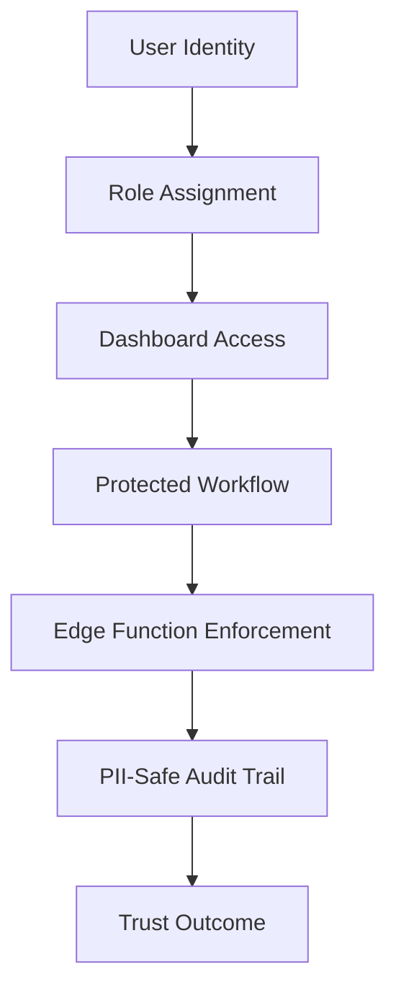
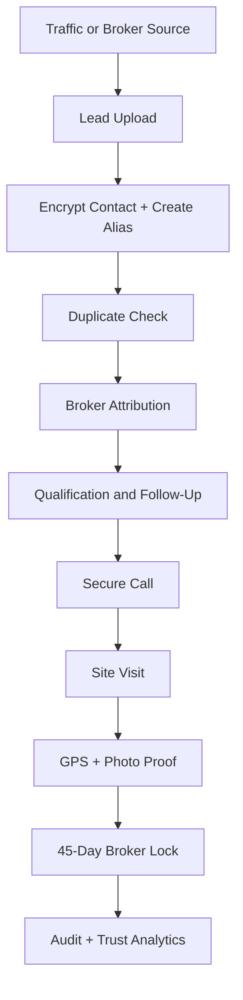

# FUTURETRUST OPERATIONAL BLUEPRINT MASTER

Generated: 2026-05-16
Project: FutureTrust Real Estate OS / The Sourcing Manager OS
Official verdict: B. PARTIAL - PROVIDER/CONFIG BLOCKERS REMAIN

## Harsh-Truth Position

FutureTrust is not officially pilot-ready until the live provider-backed trust loop passes the release gate.

The internal trust-loop state machine has strong proof, but simulated signed callbacks and manual UAT state transitions are not field proof. They prove logic shape. They do not prove operational readiness.

## What Is Proven

The current internal UAT path has validated:

- broker onboarding through server-governed role assignment,
- PII-safe lead upload with alias creation,
- sensitive table isolation from frontend clients,
- duplicate lead blocking without contact exposure,
- caller assignment and active data-loan creation,
- secure-call fail-closed behavior,
- forged callback rejection,
- site visit scheduling,
- invalid GPS rejection,
- valid GPS verification,
- photo-proof metadata linkage,
- automated broker lock creation,
- PII-safe audit trail coverage.

This is real progress. It is not enough for Verdict A.

## What Is Not Yet Proven

The following are still hard release blockers:

- Exotel production secrets are not fully configured in the verified environment.
- `EXOTEL_CALLBACK_SECRET` is still required for live callback verification.
- Secure-call provider handoff is not proven end-to-end with a live provider attempt.
- Valid provider callback success path is not proven against a real provider call.
- Consent/DND readiness must be established through approved workflow or safe fixture.
- Local Edge Function hardening must be deployed before it counts as remote production behavior.
- The final release gate must exit 0.

## Operational Architecture



## Lead Trust Lifecycle



## Dataless Constitution

Non-negotiable rules remain active:

- no phone number visible,
- no masked phone number,
- no last four digits,
- no WhatsApp or `tel:` shortcut,
- no contact export,
- no frontend sensitive table reads,
- no service-role key in frontend/mobile/web,
- no PII inside audit logs,
- AI metadata only,
- protected operations through Edge Functions,
- system fails closed.

## Release Verdict Rule

Verdict A is allowed only after:

```powershell
powershell -ExecutionPolicy Bypass -File scripts\release-gate.ps1
```

exits 0 and proves:

- caller auth works,
- provider secrets are configured,
- secure-call preflight passes,
- provider handoff succeeds,
- valid callback verification succeeds,
- site visit proof passes,
- broker lock is created live,
- broker isolation remains intact,
- no PII leaks,
- AI-safe tools remain metadata-only.

## Current Official Verdict

B. PARTIAL - PROVIDER/CONFIG BLOCKERS REMAIN

Harsh truth: the system has earned trust in its internal logic. It has not yet earned field-pilot release status.
