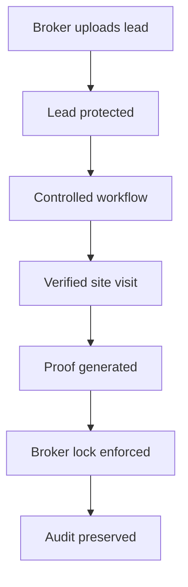
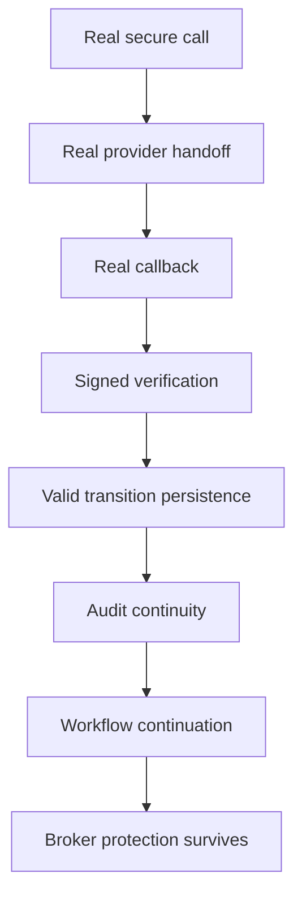

# FutureTrust Real Estate OS Deep Research Audit

What we are actually building, what is already built, and what still remains.

Date: 2026-05-16  
Status: Infrastructure-grade trust workflow system, operationally partial

## 1. Executive Truth

FutureTrust / The Sourcing Manager OS is no longer a simple CRM prototype.

The project has evolved into a governed trust infrastructure layer for Indian real estate operations.

The system is attempting to solve the biggest operational failures in Indian real estate:

- Lead theft
- Fake site visits
- Broker distrust
- Uncontrolled data sharing
- Unverified sourcing workflows
- Weak attribution systems
- Lack of operational proof
- Fragmented broker/developer coordination

The architecture is no longer centered around dashboards, lead lists, telecalling, or generic automation.

The architecture is now centered around:

- Trust enforcement
- Controlled access
- Proof-based workflows
- Attribution protection
- Auditability
- Deterministic state transitions
- Governed backend execution

This is the project's actual identity.

## 2. What We Are Building

The real category is:

> A trust-protected real estate workflow infrastructure.

It is not another CRM, broker app, AI startup, lead marketplace, or dialer system.

The system acts as:

- Workflow governor
- Secure broker vault
- Attribution engine
- Verified site visit system
- Controlled data access layer
- Operational audit engine

## 3. Core Philosophy

Traditional CRM systems treat customer contact data as the asset.

FutureTrust treats verified operational truth as the asset.

That is the foundational shift.

## 4. What Is Already Built

### A. Identity And Access Layer

Status: Strong

Implemented:

- Google login
- Supabase Auth
- Onboarding workflow
- Role assignment
- Organization linking
- Broker isolation
- Caller roles
- Sourcing manager roles
- Admin approval gate
- Invite-based caller onboarding

Backend functions:

- `complete-onboarding`
- `invite-user`
- `assign-role`
- `activate-user`
- `suspend-user`

Important architectural achievement:

The frontend no longer directly controls trust-critical onboarding.

### B. Dataless Constitution

Status: Strongest part of the system

Implemented:

- `leads_public`
- `leads_sensitive`
- Encrypted phone storage
- Phone hashing
- Duplicate detection
- No raw phone exposure
- No masked-phone display
- No `tel:` links
- No WhatsApp exposure
- No sensitive-table frontend reads

This is currently the system's strongest moat.

### C. Broker Isolation

Status: Mostly proven

Implemented:

- Organization isolation
- RLS policies
- Broker-specific visibility
- Linked broker access checks
- Unique broker codes
- Lock visibility restrictions

This prevents broker lead leakage, cross-tenant reads, and accidental dashboard overlap.

### D. Lead Intake System

Status: Strong

Implemented:

- Broker lead upload
- External broker intake
- Duplicate prevention
- Lead alias generation
- Audit logging
- Broker attribution
- Lead-quality metadata
- Controlled workflow assignment

The lead lifecycle is now structurally governed.

### E. Data Loan Governance

Status: Very important, mostly working

Implemented:

- Temporary access grants
- Revocable access
- Purpose-bound loans
- Call-specific access
- Visit-specific access
- Expiry checks
- Assignment validation

This is one of the project's most unique architectural ideas.

### F. Secure PSTN Bridge

Status: Logic complete, operationally blocked

Implemented:

- `initiate-call`
- `broker-self-secure-call`
- `initiate-broker-call`
- Callback verification logic
- Replay protection
- Signed callback flow
- `call_attempts` logging
- Exotel connector structure

Not yet proven live:

- Real provider handoff
- Valid callback acceptance
- Full provider callback loop
- Real-world callback persistence

This is currently the main blocker.

### G. Site Visit Verification System

Status: Strong, near pilot-grade

Implemented:

- Site visit proposal
- Review workflow
- Scheduling
- GPS verification
- Photo proof upload
- Proof progression
- Broker review
- Visit verification state machine

The system correctly treats visit verification as a trust event, not a CRM checkbox.

### H. Broker Lock System

Status: Strong strategic moat

Implemented:

- 45-day broker lock
- Brokerage tracking
- Lock countdown
- Attribution visibility
- Payout linkage
- Verified-visit-triggered protection

This is the system's operational trust moat.

### I. Audit Layer

Status: Excellent

Implemented:

- Append-only `audit_events`
- Abuse events
- Trust scoring
- Risk notifications
- Diagnostics
- Replay rejection logging
- Transition logging

This gives the system infrastructure-grade observability.

### J. Lead State Machine

Status: Conceptually correct, enforcement incomplete

A major breakthrough occurred when the project separated:

- Trust state
- Sales temperature
- Workflow action
- Attribution state

This was a major correction because:

- Warm lead does not mean verified lead.
- Hot lead does not mean protected lead.
- Called lead does not mean site verified.

The architecture now correctly models intent, trust, workflow, and attribution as separate systems.

Still missing:

- Strict runtime enforcement everywhere
- Blocked transition hardening
- Universal transition validator

### K. AI-Safe Tool Layer

Status: Architecturally correct, intentionally limited

Implemented:

- Metadata-only AI access
- Trust-safe lead summary
- Lock status tool
- Next-action recommendation
- Follow-up risk engine
- Proof metadata access

AI currently cannot:

- Access raw PII
- Create broker locks
- Verify visits
- Override trust events

This is the correct direction.

## 5. What Is Not Actually Built Yet

### A. Live Provider Trust Loop

Biggest missing piece.

Not fully proven:

- Live Exotel bridge
- Valid callback acceptance
- End-to-end provider persistence
- Live trust-loop completion
- Release gate exit 0

Without this, the infrastructure is logically correct but externally unproven.

### B. Runtime State Machine Enforcement

The lifecycle model exists conceptually, but enforcement is incomplete.

Still needed:

- Centralized transition engine
- Role-gated transition validator
- Hard blocked transitions
- Deterministic next-action enforcement
- Transition-level tests

### C. Production Governance

Still missing:

- Scope freeze discipline
- Deployment governance
- Migration approval governance
- Operational release policy
- Rollback procedures
- Environment parity verification

Currently, repo sprawl is becoming a risk.

### D. Real Operational Scale Testing

Not yet proven:

- 1000+ concurrent workflows
- Queue reliability
- Callback concurrency
- Lock race-condition resistance
- Large audit volume scaling
- Provider outage handling

### E. Human Operations Layer

Still weak:

- Broker onboarding training
- Workflow education
- Field support process
- Operational SOPs
- Customer-support logic
- Escalation management

The software is ahead of the operational organization.

## 6. What Should Not Be Built Yet

The project is currently vulnerable to premature expansion.

Avoid building:

- AI calling
- AI churn engine
- Autonomous agents
- Massive dashboards
- Payout expansion
- Blockchain layer
- Investor analytics overload
- Bulk automation
- WhatsApp automation
- AI copilot execution systems

These should wait until the trust loop is fully proven.

## 7. Real Current State

| Layer | Status |
| --- | --- |
| Identity | Strong |
| Isolation | Strong |
| Lead vault | Strong |
| Broker attribution | Strong |
| Site visit verification | Strong |
| Audit layer | Strong |
| Trust logic | Strong |
| Provider execution | Incomplete |
| Operational proof | Incomplete |
| Scale proof | Missing |
| Human ops | Weak |

## 8. Real Competitive Moat

The moat is not AI, dashboards, CRM features, or automation.

The moat is protected operational attribution:

Very few systems do this correctly.

## 9. What The Project Could Become

If completed correctly, FutureTrust becomes the operating trust layer between brokers, developers, callers, and buyers.

Not just a CRM.

Eventually, the same infrastructure can govern:

- Broker coordination
- Sourcing verification
- Site proof
- Payout governance
- Trust scoring
- Workflow compliance
- Provider orchestration

That is a much bigger category.

## 10. Current Final Verdict

Real honest verdict:

> B. PARTIAL - PROVIDER/CONFIG BLOCKERS REMAIN

The project is architecturally impressive, structurally disciplined, and operationally incomplete.

The trust-loop infrastructure is now strong enough that fake progress becomes dangerous.

The next phase must focus only on:

- Provider handoff
- Callback proof
- Release gate exit 0
- Isolation proof
- Operational verification

It must not focus on feature expansion.

## 11. Single Most Important Next Goal

Complete the real trust loop.

That means proving:

When that works, the project crosses from interesting architecture to operational infrastructure.

## 12. Summary

This audit separates:

- Architecture reality
- Operational proof
- Infrastructure maturity
- Missing execution layers
- Strategic direction

Most important conclusion:

> The project is no longer a CRM prototype. It is becoming a governed trust infrastructure layer.

Current honest status:

> B. PARTIAL - PROVIDER/CONFIG BLOCKERS REMAIN

Next real milestone:

> Prove the live secure-call provider trust loop end-to-end.
