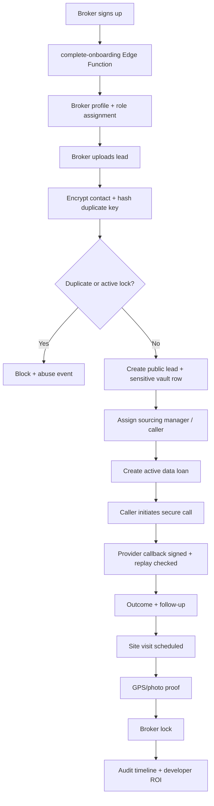

# FutureTrust Trust Infrastructure Audit

Date: 2026-05-15
Repo: `C:\Users\iBUGG3D\Desktop\The Sourcing MAnager OS`
Mode: harsh truth, infrastructure-first, security-first

## Executive Verdict

FutureTrust is directionally a trust-infrastructure product, not a CRM. The repo has the right bones: Flutter client, Supabase Auth, RLS, Edge Functions, encrypted lead storage, data loans, secure call bridge, site visit proof, broker locks, audit events, and release gates.

Harsh truth: the complete trust loop is not operationally proven. Current evidence shows broker onboarding, encrypted lead upload, sensitive-table denial, duplicate prevention, assigned sourcing manager visibility, and PII-safe audit reads are working. The loop is still blocked at caller credentials and provider secrets, so the system must not be called controlled-pilot ready until secure call -> provider callback -> follow-up -> site visit proof -> broker lock is live-proven.

Current maturity: hardened field-pilot infrastructure MVP.

Current readiness: partial. Broker intake is proven; call/visit/lock is code-hardened but live-blocked.

## PRD

### Product Vision

FutureTrust is India real estate trust infrastructure for protecting work, verifying effort, reducing operational chaos, and preserving broker attribution.

It is not a generic CRM, property portal, broker app, or AI wrapper. Its core value is defensible workflow evidence.

### Core Users

- Broker owner / broker agent: uploads leads, tracks protected work, sees locks and payout status.
- Sourcing manager: owns broker network, assigns callers, schedules and verifies visits.
- Caller: works only from a secure queue, cannot see or export phone numbers.
- Developer / admin: sees verified ROI, not raw broker lead data.
- Platform admin: governs roles, abuse, disputes, activation, and compliance.
- Buyer: indirectly benefits from less spam and better coordination.

### Core Trust Loop

Broker signup -> server onboarding -> encrypted lead upload -> duplicate check -> caller assignment -> data loan -> secure call bridge -> call outcome -> follow-up -> site visit scheduling -> GPS/photo proof -> broker lock -> audit timeline -> developer ROI.

### MVP Success Criteria

- No phone number visible in frontend, logs, API responses, audit context, or browser network.
- Broker A cannot read Broker B leads, locks, or sensitive rows.
- Caller cannot call without active data loan.
- Provider callback cannot be forged or replayed.
- GPS/photo proof is stateful and one-way.
- Broker lock creation is conflict-protected.
- Audit events are append-only and PII-safe.
- One live broker-to-lock path passes with real test users and configured provider secrets.

## TRD

### Stack Reality

- Frontend: Flutter PWA / Android APK under `flutter_app`.
- Backend: Supabase Auth, PostgreSQL, RLS, Edge Functions.
- Auxiliary web dashboard: Next.js under `web-dashboard`; not the canonical mobile field app.
- Call provider: Exotel path exists; provider secrets are reported missing/blocking.
- AI: metadata-only support exists through `ai-lead-response`; it must remain assistant-layer only.

### Release Gates

Required local gates:

```powershell
npm run security
python scripts/security-check.py
npm run build
npx tsc --noEmit
npm run sprint7:check
flutter analyze
flutter build web --release
node scripts/uat-trust-loop.mjs
```

Required live gates:

```powershell
supabase db push
supabase functions deploy <changed-function>
supabase secrets list
node scripts/uat-trust-loop.mjs
```

Live UAT may be BLOCKED by missing Exotel secrets or invalid test credentials. A blocked live dependency is not a pass.

## Backend Architecture

### Sensitive Data Boundary

Public metadata:

- `leads_public`: alias, area, city, budget, status, assignment, project, conversion, brokerage metadata.
- `brokers_public`: broker identity metadata, status, performance, assignment.
- `site_visits`, `broker_locks`, `audit_events`: workflow proof and attribution metadata.

Sensitive storage:

- `leads_sensitive`: encrypted contact value and deterministic hash.
- `brokers_sensitive`: encrypted broker contact values.

Frontend must never query `leads_sensitive` or `brokers_sensitive`. Current source scan found no Flutter/web direct reads of those tables.

### Protected Actions

Protected actions should remain Edge Function only:

- `complete-onboarding`
- `broker-upload-lead`
- `lead-from-broker`
- `manage-caller-workflow`
- `initiate-call`
- `exotel-callback`
- `propose-site-visit`
- `start-site-visit`
- `verify-site-gps`
- `verify-site-visit-proof`
- `broker-vault-workflow`

### Deterministic State Machines

Call states:

`connecting -> queued -> completed|failed`

Terminal states must not move backward. `exotel-callback` enforces signed callback token, replay hash, and transition checks.

Lead states:

`new -> call_queued -> interested|call_later|not_reachable|wrong_lead -> visit_scheduled -> visit_verified -> locked`

Site visit proof states:

`scheduled -> started -> gps_verified -> qr_verified|photo_uploaded -> visit_done`

Broker lock states:

`active -> expired|disputed|released`

Brokerage states:

`tracking -> eligible|paid|disputed|blocked`

## Schema Architecture

Core trust tables:

- `role_assignments`, `pilot_users`, `organizations`
- `brokers_public`, `brokers_sensitive`
- `leads_public`, `leads_sensitive`
- `data_loans`, `call_attempts`
- `site_visits`, `site_visit_proposals`, `site_visit_confirmations`
- `broker_locks`, `broker_activity_logs`, `broker_followups`
- `audit_events`, `abuse_events`, `risk_notifications`
- `payout_ledger`, `payout_statements`

Important controls found:

- `leads_sensitive` has RLS enabled and forced, with broad revoke from `anon`, `authenticated`, and `public`.
- `brokers_sensitive` has RLS forced and `SELECT` revoked from authenticated users.
- `audit_events` is append-only by trigger.
- `broker_locks` has active-lock uniqueness and later conflict hardening.
- `call_attempts` has callback replay columns and unique callback event hash.
- Reporting views were later hardened with `security_invoker = true`, but this remains a sensitive area to keep testing.

## App Flow

### New User

Open app -> login / Google login -> Supabase session -> role resolver -> no active role -> executive onboarding -> `complete-onboarding` Edge Function -> role dashboard.

### Broker

Dashboard -> lead vault -> add lead -> contact sent once to Edge Function -> encrypted storage -> duplicate check -> assignment visibility -> follow-up/visit proposals -> active locks -> brokerage status.

### Sourcing Manager

Dashboard -> broker network -> lead review -> caller assignment/data loan -> interested leads -> site visits -> GPS/photo proof -> broker locks -> performance.

### Caller

Secure queue -> public metadata only -> secure call button -> provider bridge -> outcome -> follow-up. No phone display, no tel link, no WhatsApp link, no export.

### Site Visit

Scheduled -> start visit -> GPS geofence -> photo/proof -> visit done -> broker lock -> audit event.

## UI/UX Audit

What works:

- Role dashboards exist for broker, sourcing manager, caller, and admin.
- Caller queue uses secure-call language and does not expose contact numbers.
- Broker dashboard surfaces lead vault, locks, follow-ups, visits, and brokerage status.
- Production training mode is gated by `kReleaseMode` and environment.

Harsh-truth UX gaps:

- Several dashboards are too wide and operationally dense for one-hand field use.
- Some live screens still use `select('*')` on public operational tables. RLS may protect this, but field apps should request exact columns to avoid accidental metadata exposure when schemas evolve.
- Some UI copy is still demo-like or hardcoded, for example named greetings and fixed project references.
- Error handling sometimes shows raw caught exceptions in Flutter snackbars. Even if server responses are safe, client surfaces should map to stable operational messages.
- The UI still feels like many dashboards plus a training runtime, not a single disciplined command workflow.

Target UX rule:

Every screen should make the next operational action obvious: call now, assign caller, schedule visit, verify GPS, upload proof, resolve dispute, or collect brokerage.

## Security Audit

Strengths:

- Sensitive lead contact is encrypted and stored separately.
- Duplicate prevention uses deterministic hash rather than raw contact.
- Data loans are explicit and time-bound.
- Secure call fetches/decrypts PII only server-side.
- Callback endpoint is unsigned-JWT by necessity but protected with HMAC token.
- Security scans now reject frontend/Edge runtime logging, direct phone links, masked-contact display, raw provider payload terms, and raw Edge Function error reasons.

Weak points:

- `complete-onboarding` previously accepted legacy `broker` and returned raw internal errors. This pass patched the local source to canonicalize `broker` to `broker_owner`, allow only Sprint 7 roles, and return `onboarding_failed`.
- `complete-onboarding` still resolves the first active organization. This is only acceptable for a single controlled pilot. It is not multi-org safe.
- Some scripts and reports contain older contradictory production claims. The latest trust-loop status should override older "production active" language.
- AI voice path must be kept metadata-governed. Any attempt to pass raw contact or transcript PII into AI turns this product into a liability.

## Implementation Patch Applied In This Pass

Files changed:

- `supabase/functions/complete-onboarding/index.ts`
- `scripts/security-check.mjs`
- `scripts/security-check.py`
- `docs/superpowers/plans/2026-05-15-futuretrust-onboarding-hardening.md`

Behavior changed:

- Legacy client role `broker` is mapped to canonical `broker_owner`.
- Allowed onboarding roles are now `broker_owner`, `broker_agent`, `sourcing_manager`, and `caller`.
- Broker profile branch now follows canonical broker roles.
- Raw onboarding exception reasons are no longer returned to clients.
- Security gates now fail future Edge Functions that return raw `error.message`, `err.message`, `msg`, or `unknown_error` as public reasons.

Deployment note:

This patch is local source until `complete-onboarding` is deployed.

## Workflow Map



## Pilot Readiness Checklist

Go only when all are true:

- [ ] Remote `PHONE_ENCRYPTION_KEY` is set and rotated safely.
- [ ] Remote Exotel secrets are set: SID, API key, token, caller ID, callback secret.
- [ ] `CALLER_INVITE_CODE` is set remotely.
- [ ] Test broker, sourcing manager, and caller credentials work.
- [ ] Broker A vs Broker B isolation is live-tested.
- [ ] Caller without data loan is blocked.
- [ ] Caller with active data loan can queue a provider call.
- [ ] Forged callback is rejected.
- [ ] Replay callback is rejected.
- [ ] Call outcome creates correct follow-up state.
- [ ] GPS outside geofence is rejected.
- [ ] GPS inside geofence is accepted.
- [ ] Photo proof path is PII-safe.
- [ ] Visit completion creates or updates a 45-day broker lock.
- [ ] Duplicate lead claim is blocked without exposing contact.
- [ ] Audit response contains no PII.
- [ ] Browser network tab contains no phone number.
- [ ] Edge Function logs contain no raw contact or raw provider payload.
- [ ] Field team can run the workflow without developer intervention.

## Priority Implementation Plan

1. Deploy the local `complete-onboarding` hardening patch.
2. Set missing remote provider and callback secrets.
3. Create or repair caller test credentials.
4. Run `node scripts/uat-trust-loop.mjs` until call/visit/lock is PASS, not BLOCKED.
5. Add a second broker identity and run cross-broker isolation UAT.
6. Replace `select('*')` in Flutter operational screens with exact metadata column lists.
7. Normalize client error messages to stable user-safe reason labels.
8. Add an operator-facing trust-loop health screen: secrets present, caller account valid, provider status, callback failure count, GPS failure count, duplicate-block count.
9. Freeze new AI/product features until the first full live broker-to-lock loop passes.

## Final Harsh Truth

This product should not be judged by number of screens, dashboards, or AI hooks.

The only meaningful pilot question is:

Can one real broker safely upload one real lead, get one real call, generate one real verified site visit, and receive one defensible broker lock without contact leakage or attribution dispute?

As of the current repo evidence, the answer is: not yet proven.
