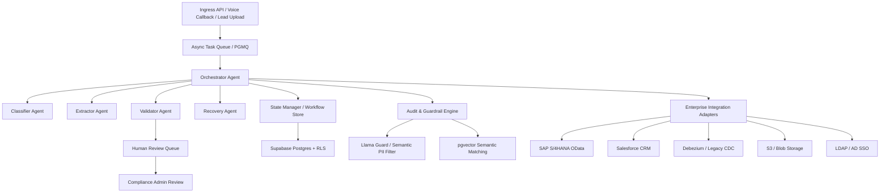

# Enterprise Architecture and Multi-Agent Orchestration Blueprint

Generated: 2026-05-23
Project: The Sourcing Manager OS / FutureTrust Real Estate OS

## Executive Summary

This document defines an enterprise-ready architecture for scaling The Sourcing Manager OS with a hardened, multi-agent orchestration layer built on Supabase Postgres, Supabase Edge Functions, and human-in-the-loop trust enforcement.

The blueprint is designed for:
- high-volume voice and lead ingestion,
- asynchronous stateful task orchestration,
- strict PII-safe workflows,
- enterprise integration adapters,
- defender-level reliability and auditability.

## Design Principles

1. **Fail-Closed Security**
   - Protect sensitive workflows through service-role Edge Functions and RLS.
   - Reject any request that cannot be validated with strong schema, identity, and policy checks.

2. **Asynchronous Decoupling**
   - Use Postgres-backed queuing and task state tables to avoid blocking high-throughput ingest flows.
   - Ensure voice call traffic and lead ingestion are processed independently from downstream auditing and classification.

3. **Agent Cooperative Orchestration**
   - Implement a central orchestrator that delegates work to specialized sub-agents.
   - Keep agent responsibilities narrow: classification, extraction, validation, recovery, and review.

4. **Human-in-the-Loop Trust**
   - Route uncertain decisions into manual review queues for Compliance Admins.
   - Preserve automated throughput while enabling arbitration for high-risk or low-confidence outcomes.

5. **Enterprise Integration Interfaces**
   - Provide secure adapters for CRM, ERP, legacy DB CDC, storage, email, and identity.
   - Keep adapters isolated behind authenticated service boundaries.

## Core Topology

## Enterprise Architecture Layers

### 1. Data and Persistence Layer

- **Supabase Postgres** is the source of truth for identity, lead state, orchestration workflow state, audit trails, and safe metadata.
- **Queue / Task Store** should be implemented as Postgres-first queue tables and helpers, compatible with Postgres Message Queue semantics.
- **Vector embeddings** and semantic signatures leverage `pgvector` for PII detection, similarity checks, and guardrail lookups.
- **Read replicas** and **PgBouncer / Supavisor** support low-latency reads and connection pooling.

### 2. Edge Function / Control Layer

- The repo already contains many Supabase Edge Functions such as `create-organization`, `complete-onboarding`, `ai-voice-callback`, `assign-role`, `route-incoming-leads`, `trust-recommend-next-action`, `exotel-callback`, and `system-health-check`.
- A new **Orchestrator Edge Function** should act as the central coordinator for multi-agent workflows.
- All sensitive decisions must execute within Edge Functions using service-role authorization, not in the frontend.

### 3. Orchestration and Multi-Agent Layer

#### Orchestrator Agent

- Receives a normalized task envelope from the ingest queue.
- Executes a deterministic workflow plan:
  - classify task type,
  - load task context,
  - route to the next agent,
  - update state,
  - trigger necessary downstream actions.
- Maintains state transitions in a workflow table.

#### Classifier Agent

- Categorizes incoming tasks (voice callback, lead upload, CRM sync, trust review, etc.).
- Assigns risk tiers and trust labels.
- Flags tasks requiring human review.

#### Extractor Agent

- Normalizes raw payloads into structured domain objects.
- Extracts metadata, contact aliases, carrier information, and source affinity.
- Creates stable artifact IDs for tracking.

#### Validator Agent

- Enforces strict schema checks and domain assertions.
- Runs semantics-based guardrails using `pgvector`.
- Detects prompt injection, PII, unsafe field values, and unexpected formats.
- Converts parser errors into structured recovery tickets.

#### Error Recovery Agent

- Handles retryable failures, schema mismatches, and invalid outputs.
- Escalates unrecoverable states into a human review queue.
- Maintains retry budgets, backoff policies, and failure classifications.

#### State Manager Agent

- Persists workflow state and task lifecycle transitions.
- Ensures idempotent processing with unique task keys and deduplication.
- Records audit events with PII-safe metadata only.

### 4. Human-in-the-Loop Review

- Create a dedicated compliance review queue for tasks with:
  - failed validation,
  - low-confidence classification,
  - red-team or audit triggers,
  - policy exceptions.
- Support a manual override path with strict audit logging and decision provenance.
- Preserve automation by returning human-reviewed decisions to the orchestrator for final completion.

## Reliability and Guardrails

### Real-Time Guardrails

- Integrate `Llama Guard` or a comparable guardrail library before any LLM prompt submission.
- Block sensitive payload content, PII leakage, or high-risk task patterns.
- Enforce guardrails at the orchestrator boundary.

### Structured Assertions

- Define domain schemas for all task types.
- Validate every LLM or extraction output against a strict schema.
- If validation fails, route the task to the Error Recovery Agent instead of letting bad data flow downstream.

### Audit and Observability

- Capture event-level audit records for:
  - ingest timestamps,
  - actor identity and role,
  - task decisions,
  - review outcome,
  - integration actions,
  - failure reasons.
- Audit logs must exclude raw PII and should use alias tokens or fingerprint metadata.
- Add operational dashboards for queue depth, retry rates, review lag, and trust anomaly counts.

## Enterprise Integration Interfaces

### SAP S/4HANA (OData)

- Build a secure adapter that queries and writes transactional data using SAP OData endpoints.
- Use service-to-service credentials stored in protected Supabase secrets.
- Keep SAP integration logic separate from core trust workflows.

### Salesforce CRM

- Synchronize lead, account, and activity records through a dedicated CRM adapter.
- Use webhook-based ingestion for live events and scheduled synchronization for eventual consistency.
- Preserve PII-safe fields by storing only hashed or encoded contact references in the core workflow.

### Legacy DB CDC via Debezium

- Capture legacy source events with Debezium into Postgres staging tables.
- Normalize CDC events into orchestrator tasks.
- Use a bounded transformation layer to avoid schema drift.

### Storage / SMTP / SSO

- Store large content or proofs in S3 / Blob storage behind signed URLs.
- Send notifications through SMTP relay adapters using queued delivery.
- Authenticate enterprise users with LDAP / Active Directory SSO and sync roles safely.

## Recommended Implementation Modules

1. **Orchestrator Edge Function**
   - `supabase/functions/enterprise-orchestrator/`
   - Central workflow entry point for all multi-agent tasks.

2. **Queue Migration and Helpers**
   - `supabase/migrations/20260523000000_enterprise_task_queue.sql`
   - Task queue tables, enqueue/dequeue helpers, deduplication constraints, and task history.

3. **Agent Subsystem Helpers**
   - `supabase/functions/_shared/orchestration/` for reusable validation and state utilities.
   - `supabase/functions/_shared/guardrails/` for PII blocking and schema validation.

4. **PGMQ Compatibility Layer**
   - Provide a Postgres-native queue pattern using job tables and row-lock dequeue semantics.
   - Optionally layer a `pgmq`-style API if the project later migrates to a standalone queue layer.

5. **Compliance Review Dashboard**
   - Add a manual review queue UI slice to the `flutter_app` or `web-dashboard` with strong permission gating.
   - Reviewers see only metadata and action buttons, never raw sensitive contact fields.

## Operational Checklist

- [ ] Add `pgvector` extension and secure embeddings columns in Supabase Postgres.
- [ ] Add `Llama Guard` or equivalent guardrail integration in Edge Functions.
- [ ] Add queue migration and task lifecycle tables.
- [ ] Add orchestrator Edge Function with strict request contract.
- [ ] Add agent-specific helpers for classification, extraction, validation, recovery, and state management.
- [ ] Add human review queue and Compliance Admin workflow.
- [ ] Add enterprise adapters for SAP, Salesforce, CDC, storage, SMTP, and LDAP.
- [ ] Harden all new paths with RLS, security-definer helpers, and audit-only side effects.
- [ ] Add smoke tests for queue processing, agent workflows, review escalation, and integration connectors.

## Fit With The Sourcing Manager OS

This blueprint extends the existing architecture in this repo by:
- introducing a controlled asynchronous orchestration layer,
- preserving the current Supabase + Edge Functions security model,
- enabling a scalable trust and audit pipeline for high-volume voice/lead operations,
- adding strong enterprise connector boundaries for CRM, ERP, and legacy systems.

The result is a layered, enterprise-ready system that can scale beyond pilot traffic while preserving the safe, fail-closed trust guarantees already established in the project.
