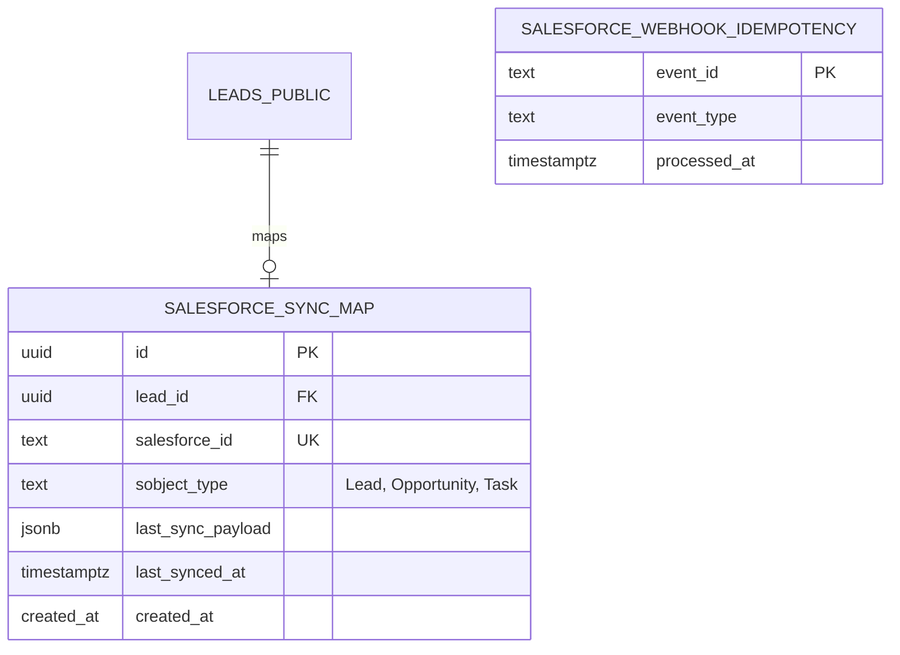

# Data Model: Salesforce CRM Synchronization Adapter

## Summary

This document specifies the database tables, fields, relationships, Row Level Security (RLS) policies, and entity mappings required to support secure, transactional Salesforce CRM synchronization.

---

## 1. Schema Additions

To support mapping Sourcing Manager OS entities to Salesforce SObjects, and to prevent duplicate inbound processing, the following tables are introduced:



### 1.1 `public.salesforce_sync_map`
Stores bidirectional ID mapping records between local lead objects and external Salesforce SObjects.

| Field | Type | Constraints | Description |
|---|---|---|---|
| `id` | `UUID` | `PRIMARY KEY`, `DEFAULT gen_random_uuid()` | Unique mapping record ID. |
| `lead_id` | `UUID` | `REFERENCES public.leads_public(id) ON DELETE CASCADE`, `NOT NULL` | References the local public lead record. |
| `salesforce_id` | `TEXT` | `NOT NULL`, `UNIQUE` | The external Salesforce SObject ID (e.g. `00Q8c00001yZabc`). |
| `sobject_type` | `TEXT` | `NOT NULL` | The SObject type: `'Lead'`, `'Opportunity'`, or `'Task'`. |
| `last_sync_payload` | `JSONB` | `NOT NULL DEFAULT '{}'::jsonb` | PII-free copy of the last synchronized payload for comparison. |
| `last_synced_at` | `TIMESTAMPTZ` | `NOT NULL DEFAULT now()` | Timestamp of the last sync run. |
| `created_at` | `TIMESTAMPTZ` | `NOT NULL DEFAULT now()` | Record creation timestamp. |

#### Indices
- `CREATE UNIQUE INDEX idx_salesforce_sync_map_lead_sobject ON public.salesforce_sync_map (lead_id, sobject_type);`
- `CREATE INDEX idx_salesforce_sync_map_salesforce_id ON public.salesforce_sync_map (salesforce_id);`

### 1.2 `public.salesforce_webhook_idempotency`
Stores webhook message unique identifiers to enforce single-delivery semantics.

| Field | Type | Constraints | Description |
|---|---|---|---|
| `event_id` | `TEXT` | `PRIMARY KEY` | Unique Salesforce event ID or message signature hash. |
| `event_type` | `TEXT` | `NOT NULL` | Category of the inbound event (e.g. `Lead_Captured`). |
| `processed_at` | `TIMESTAMPTZ` | `NOT NULL DEFAULT now()` | When the message was processed. |

---

## 2. Row Level Security (RLS) Policies

All database additions must conform to the project's strict RLS requirements:
- No anonymous or public authenticated direct client writes are permitted on the synchronization mapping tables.
- Access is restricted exclusively to the `service_role` (for Edge Function processing).

```sql
-- Enable RLS
ALTER TABLE public.salesforce_sync_map ENABLE ROW LEVEL SECURITY;
ALTER TABLE public.salesforce_webhook_idempotency ENABLE ROW LEVEL SECURITY;

-- Force RLS
ALTER TABLE public.salesforce_sync_map FORCE ROW LEVEL SECURITY;
ALTER TABLE public.salesforce_webhook_idempotency FORCE ROW LEVEL SECURITY;

-- Deny client access
CREATE POLICY salesforce_sync_map_service_only ON public.salesforce_sync_map
  FOR ALL TO authenticated USING (false) WITH CHECK (false);

CREATE POLICY salesforce_webhook_idempotency_service_only ON public.salesforce_webhook_idempotency
  FOR ALL TO authenticated USING (false) WITH CHECK (false);
```

---

## 3. Entity Mappings (SObjects)

To guarantee that zero restricted contact data (PII) is exported, local lead objects map to standard Salesforce SObjects using metadata-only fields.

### 3.1 Lead Status & Lock (Local `leads_public` -> Salesforce `Lead` or `Opportunity` SObject)

| Local Field | Salesforce SObject Field | Purpose | PII Status |
|---|---|---|---|
| `id` (UUID) | `Sourcing_Manager_OS_ID__c` (Custom Text UK) | Bidirectional mapping key | Safe (UUID) |
| `alias` | `LastName` (Lead) / `Name` (Opportunity) | Entity name reference | Safe (Alias string) |
| `status` | `Status` (Lead) / `StageName` (Opportunity) | Lifecycle phase synchronization | Safe (Enum status) |
| `area` | `Address_Area__c` (Custom Text) | Location interest | Safe |
| `city` | `City` / `Address_City__c` | Location interest | Safe |
| `budget` | `Budget__c` / `Amount` | Financial range | Safe |
| `broker_lock_status` | `Brokerage_Locked__c` (Custom Checkbox) | Active allocation indicator | Safe |
| `sourcing_manager_id` | `Assigned_Sourcing_Manager__c` (Custom Text) | Sourcing assignment trace | Safe (UUID) |

### 3.2 Secure Interaction Outcomes (Local `calls` / `follow_ups` -> Salesforce `Task` SObject)

Completed interactions map to Task SObjects linked to the primary Salesforce Lead/Opportunity record.

| Local Field | Salesforce Task SObject Field | Purpose | PII Status |
|---|---|---|---|
| `id` (UUID) | `Sourcing_Manager_OS_Interaction_ID__c` | Mapping identifier | Safe |
| `salesforce_id` (Mapped Parent) | `WhoId` (Lead) / `WhatId` (Opportunity) | Link to parent record | Safe |
| `duration_seconds` | `CallDurationInSeconds` | Interaction length | Safe |
| `call_outcome` | `Subject` / `Status` / `CallType` | Interaction categorization | Safe |
| `notes` | `Description` | Scrubbed caller activity logs | **PII-Scrubbed** (Zero phone numbers or caller names allowed) |
